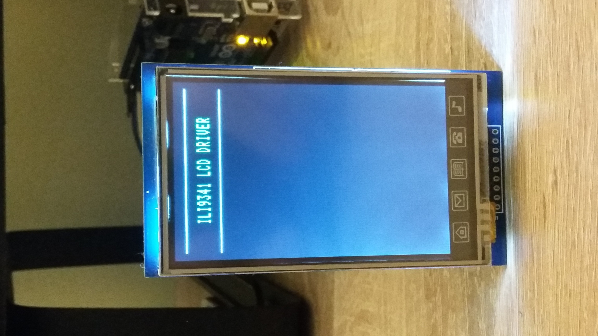

# C Library for ILI9341 2.8 TFT LCD Display

## ILI9341 Description
Detailed information are described in [Datasheet ILI9341](https://cdn-shop.adafruit.com/datasheets/ILI9341.pdf).

## Library
C library is aimed for driving [ILI9341 2.8 TFT LCD display](#demonstration) 240x320 using 8080-I/II Series Parallel Interface.

## Hardware connection
- 5V => 5V
- 3.3V => NC, 
- GND => GND, 
- RST => PORTD[4]
- CS => PORTD[3]
- RS => PORTD[2]
- WR => PORTD[1]
- RD => PORTD[0]
- D[7:0] => PORTD[7:0]

### Usage
Prior defined for MCU Atmega328p / Atmega8 / Atmega16. Need to be carefull with pins definition. **_Data pins D[7:0] using one port and are in order!_**.

### Tested
Library was tested and proved on a **_ILI9341 2.8″ TFT Dispay_** with **_Atmega328p_**.
  
## Demonstration

## Links
- [Datasheet ILI9341](https://cdn-shop.adafruit.com/datasheets/ILI9341.pdf)

## Acknowledgement
- [Adafuit TFT](https://github.com/adafruit/TFTLCD-Library)
- [notro](https://github.com/notro/fbtft/blob/master/fb_ili9341.c)
- [thefallenidealist](https://github.com/thefallenidealist/ili9341/blob/master/glcd.c)
